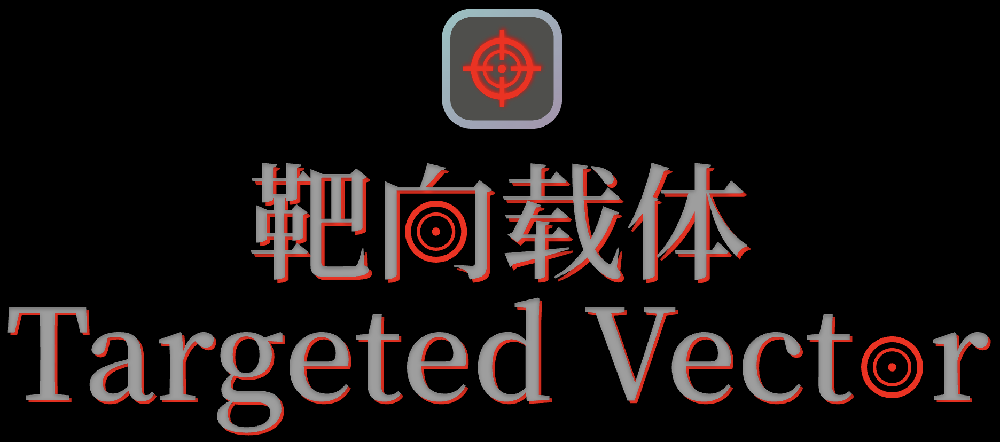

 
 
<h1 style="text-align: center;">Targeted Vector</h1>
<h4 style="text-align: center;">A unique shooting game.</h4>

[English](./README.md) | [简体中文](./README_zh.md)

---

## Contents
- [The purpose of creating the Targeted Vector](#the-purpose-of-creating-the-targeted-vector)
- [How to Contribute to Targeted Vector](#how-to-contribute-to-targeted-vector)
- [Special Thanks](#special-thanks)
- [FAQ](#faq)
- [License](#license)
- [Epilogue](#epilogue)

---

## The purpose of creating the Targeted Vector
In the past, I made a Python game called "Shilang Hunter" in 2024. However, we found that there was a significant problem with the efficiency. So I decided to create a new game called "Targeted Vector" to solve this problem.

---

## How to Contribute to Targeted Vector
Targeted Vector is an open-source project, It's normal to want to contribute to Targeted Vector. However, I do not expect anyone to contribute codes to the Targeted Vector itself in the development phase. Because Targeted Vector is moving at the pace of my development and it will be confusions if someone wants to contribute codes to the Targeted Vector.

*While I don't expect anyone to contribute code to the target vector itself during the development phase, I do expect anyone to contribute bug reports and feature suggestions.*

You can contribute to Targeted Vector in the following ways:
1. Submit bug reports and Feature Suggestions: If you encounter any bugs while playing Targeted Vector or have any feature suggestions, please create an issue in the GitHub repository or send it directly to me (Cheple_Bob@outlook.com).

---

## Special Thanks
We sincerely thank the following individuals who have made outstanding contributions to Targeted Vector:
- [GavZheng](https://github.com/GavZheng): He has made effective decisions on various trade-offs in the Targeted Vector development process.

---

## FAQ

- Why is it named "Targeted Vector"?

    *Targeted Vector is a game where players control guns with mouse to kill enemies, so it is called "Targeted", and players can also place instruments for attack, so it is also called "Vector".*

- Why was Rust chosen as the development language?

    *Because Rust has excellent language features and amazing performance, and it's not too difficult for me to learn, I chose Rust to replace Python.*

- What platforms will Targeted Vector support?

    *I will support macOS and Windows. If I have enough time, I will also support Linux.*

- What is the development status of Targeted Vector?

    *Targeted Vector is currently in the development phase (alpha stage).*

- When will you provide .dmg and .msi?

    *I will provide .dmg and .msi when the development phase is over.*

---

## License
[MIT](./LICENSE-MIT) © 2025 ChepleBob

## Epilogue
I sincerely hope you enjoy playing Targeted Vector. If you like this game, please give me a star on GitHub. And you can also join our organization called [Binder](https://github.com/Binder-organize).