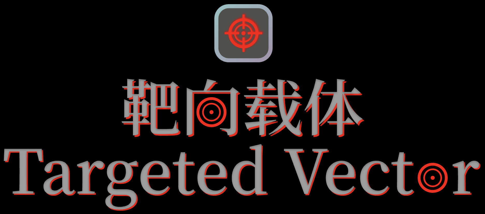

# 靶向载体

## 一款独特的射击游戏

[English](./README.md) | [简体中文](./README_zh.md)

---

## 目录

- [创造靶向载体的目的](#创造靶向载体的目的)
- [如何给靶向载体做贡献](#如何给靶向载体做贡献)
- [特别感谢](#特别感谢)
- [常见问题](#常见问题)
- [许可证](#许可证)
- [尾声](#尾声)

---

由于开发时间因素，中文版README的内容比英文版更加完整，如发现英文版的翻译问题，请提issue反馈给我。

---

## 创造靶向载体的目的

我在2024年做过一个Python游戏叫“施朗猎人”。但是，“施朗猎人”的性能太差了（在什么设备上运行都会产生严重卡顿），所以我决定用Rust重写一个性能更好、内容更完整的游戏。

---

## 如何给靶向载体做贡献

靶向载体是一个开源项目，但是由于个人因素，我并不希望有人直接提交代码（因为这样会让开发与提交代码工作变得混乱且困难）。

*但我希望大家能贡献bug报告和功能建议。*

您可以通过以下方式为靶向载体做出贡献:

1. 提交bug报告和功能建议：如果您在玩靶向载体时遇到任何bug或有任何功能建议，请在GitHub存储库中创建issue或直接发送给我（<Cheple_Bob@outlook.com>）。

---

## 特别感谢

特别感谢以下为靶向载体的辛勤建设做出杰出贡献的人士：

- [GavZheng](https://github.com/GavZheng): 为靶向载体开发过程中各种问题作出了行之有效的决策。

---

## 常见问题

- 为什么叫“靶向载体”？

    *因为靶向载体是一款玩家用鼠标控制枪支击杀敌人的游戏，所以叫“靶向”，同时玩家也可以放置工具进行攻击，所以也叫“载体”。*

- 为什么选择Rust作为开发语言？

    *因为Rust有优秀的语言特性和惊人的性能，而且对我来说学习起来也不是太难，所以我选择了Rust来代替Python。*

- 靶向载体将支持哪些平台？

    *我将支持macOS和Windows。如果我有足够的时间，我也会支持Linux。*

- 靶向载体的发展现状如何？

    *靶向载体目前处于开发阶段（alpha阶段）。*

- 什么时候能提供安装程序？

    *我将在开发阶段结束时提供.dmg（macOS安装程序）和.msi（Windows安装程序）。*

- 靶向载体会支持什么语言？

    *靶向载体本体支持简体中文和英文，其他语言计划由开发者自行添加。*

---

## 许可证

[MIT](./LICENSE-MIT) © 2025 ChepleBob

## 尾声

我诚挚地希望你喜欢玩靶向载体。如果你喜欢这个游戏，请在GitHub上给我点个star。你也可以加入我们的组织[必达](https://github.com/Binder-organize)。
